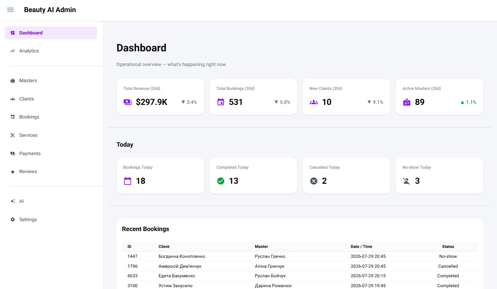
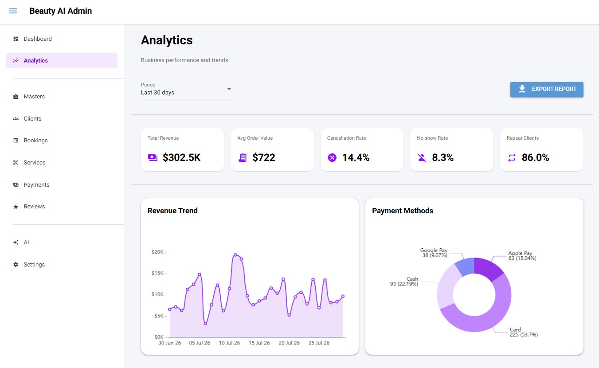

# Beauty AI Admin Panel

Admin panel for **Beauty AI** — a beauty services booking platform with management tools, analytics, bookings, clients, masters, salons, payments and services.

## Overview

Beauty AI Admin is an internal management application designed to support the administration and analytics of the Beauty AI platform.

The panel provides a centralized interface for managing operational data and monitoring platform activity.

Administrators can work with:

* bookings;
* clients;
* masters;
* salons;
* services;
* payments;
* reviews;
* analytics;
* platform settings;
* AI-related functionality.
  
  ## Preview

### Dashboard



### Analytics



> UI preview shown with sample data.

## My Contribution

I developed the admin panel as part of the Beauty AI team project.

My contribution includes:

* developing the admin interface;
* implementing dashboard and analytics pages;
* creating reusable Python/NiceGUI components;
* implementing data access modules;
* connecting the interface with backend/API data;
* working with booking, client, master, salon, service and payment data;
* implementing administrative functionality and navigation;
* structuring the application into separate pages and data-access layers.

## Tech Stack

* **Python**
* **NiceGUI**
* **REST API**
* **SQLite / database integration**
* **HTML / CSS**
* **Git / GitHub**

## Main Features

### Dashboard

Provides an overview of the platform's key operational metrics and activity.

### Analytics

The analytics section provides insights into:

* revenue;
* bookings;
* payment methods;
* booking statuses;
* customer activity;
* platform performance.

### Bookings Management

Administrators can view and manage booking information, including booking statuses and related customer/service data.

### Clients Management

Provides access to client information and customer-related platform data.

### Masters & Salons

The panel includes management interfaces for beauty masters and partner salons.

### Services

Administrators can view and manage available beauty services and related information.

### Payments

Provides access to payment-related information and transaction data.

### Reviews

Allows administrators to monitor customer reviews and feedback.

### Settings

Contains administrative settings and configuration functionality.

## Project Structure

```text
beauty-ai-admin/
├── data_access/
│   ├── bookings.py
│   ├── clients.py
│   ├── masters.py
│   ├── payments.py
│   ├── reviews.py
│   ├── salons.py
│   ├── services.py
│   └── settings.py
├── pages/
│   ├── ai.py
│   ├── analytics.py
│   ├── bookings.py
│   ├── clients.py
│   ├── dashboard.py
│   ├── layout.py
│   ├── masters.py
│   ├── payments.py
│   ├── reviews.py
│   ├── services.py
│   └── settings.py
├── api_client.py
├── config.py
├── database.py
├── main.py
├── test_db.py
├── .gitignore
└── README.md
```

## Architecture

The application is organized into separate layers:

**Pages**
User-facing admin interfaces and application views.

**Data Access**
Modules responsible for retrieving and working with platform data.

**API Client**
Handles communication with backend services.

**Database**
Database-related configuration and integration.

This structure makes the application easier to maintain and extend as the platform grows.

## Getting Started

### 1. Clone the repository

```bash
git clone https://github.com/prutkih86-oss/beauty-ai-admin.git
```

### 2. Navigate to the project

```bash
cd beauty-ai-admin
```

### 3. Create a virtual environment

```bash
python -m venv venv
```

### 4. Activate the virtual environment

Windows PowerShell:

```powershell
.\venv\Scripts\Activate.ps1
```

### 5. Install dependencies

```bash
pip install -r requirements.txt
```

> The project configuration may require additional environment variables depending on the backend and database setup.

### 6. Configure environment variables

Create a local `.env` file with the required configuration.

**Do not commit `.env` or other secrets to GitHub.**

### 7. Run the application

```bash
python main.py
```

## Project Type

**Team Project — Beauty AI Platform**

The admin panel is part of the Beauty AI platform, which combines beauty-service booking, AI-powered recommendations, administrative management and analytics.

## Repository

[GitHub Repository](https://github.com/prutkih86-oss/beauty-ai-admin)
